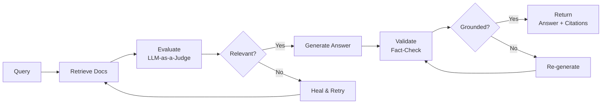

# 🤖 Self-Healing RAG Pipeline

> An autonomous, agentic Retrieval-Augmented Generation pipeline with real-time observability dashboard — built with FastAPI, Next.js, Qdrant, and LangChain principles.

## 🚀 Quick Start

### Docker (Recommended)

```bash
docker compose up --build
```

The dashboard will be available at `http://localhost`.

### Local Development

**Backend:**
```bash
cd backend
python -m venv .venv && source .venv/bin/activate
pip install -r requirements.txt
uvicorn app.main:app --reload --port 8000
```

**Frontend:**
```bash
cd frontend
bun install  # or npm install
bun dev       # or npm run dev
```

The frontend will be at `http://localhost:3000`, proxying API calls to `http://localhost:8000`.

---

## 🧠 How It Works

The Self-Healing RAG Pipeline implements a closed-loop feedback system that autonomously detects and corrects errors:



### Pipeline Steps

| Step | Description | Max Attempts |
|------|-------------|:---:|
| **RETRIEVE** | Fetch documents from Qdrant vector store | 1 |
| **EVALUATE** | LLM-as-a-Judge grades relevance (threshold: 0.6) | 1 |
| **HEAL** | Query rewrite → Param adjust → Web fallback | 3 |
| **GENERATE** | LLM produces answer with source citations | 1 |
| **VALIDATE** | Fact-checker ensures answer grounding (threshold: 0.8) | 2 |

---

## 📊 Dashboard

The observability dashboard provides:

- **Pipeline Overview**: Real-time stats on queries, confidence, healing, errors
- **Charts**: Query volume trends, confidence distribution, healing action breakdown
- **Recent Activity**: Live table of the latest pipeline executions
- **Query Detail**: Full step-by-step timeline for any pipeline run

---

## 🏗️ Architecture

```
┌──────────────┐     ┌─────────────────┐     ┌──────────┐
│   Next.js    │────▶│   FastAPI       │────▶│  Qdrant  │
│  Dashboard   │     │  Orchestrator   │     │ VectorDB │
│  Recharts    │◀────│  /api/*         │◀────│          │
└──────────────┘     └─────────────────┘     └──────────┘
                           │                       │
                     ┌─────┴─────┐          ┌──────┴──────┐
                     │ PostgreSQL │          │    Redis    │
                     │ (Metadata) │          │   (Cache)   │
                     └───────────┘          └─────────────┘
```

### Services

| Service | Technology | Port |
|---------|-----------|:----:|
| Frontend | Next.js 14 | 3000 |
| Backend | FastAPI + Python 3.11 | 8000 |
| Vector DB | Qdrant | 6333 |
| Database | PostgreSQL 16 | 5432 |
| Cache | Redis 7 | 6379 |
| Proxy | Nginx | 80 |

---

## 📡 API Endpoints

| Method | Endpoint | Description |
|--------|----------|-------------|
| POST | `/api/query` | Execute query through pipeline |
| GET | `/api/dashboard` | All dashboard metrics |
| GET | `/api/metrics/summary` | Aggregated pipeline stats |
| GET | `/api/queries/history` | Recent queries |
| GET | `/api/queries/{id}` | Single query detail |
| GET | `/health` | Health check |

---

## 🔧 Configuration

| Environment Variable | Default | Description |
|---------------------|---------|-------------|
| `DATABASE_URL` | `postgresql+asyncpg://...` | PostgreSQL connection string |
| `QDRANT_HOST` | `localhost` | Qdrant vector DB host |
| `QDRANT_PORT` | `6333` | Qdrant gRPC port |
| `LLM_PROVIDER` | `mock` | One of: mock, openai, anthropic |
| `OPENAI_API_KEY` | — | OpenAI API key (if using openai) |
| `ANTHROPIC_API_KEY` | — | Anthropic API key (if using anthropic) |
| `RELEVANCE_THRESHOLD` | `0.6` | Relevance pass threshold |
| `CONFIDENCE_THRESHOLD` | `0.8` | Generation confidence threshold |
| `MAX_HEALING_ATTEMPTS` | `3` | Max healing loop iterations |
| `CORS_ORIGINS` | `["http://localhost:3000"]` | Allowed CORS origins |

---

## 📁 Project Structure

```
├── backend/               # FastAPI application
│   ├── app/
│   │   ├── api/routes/    # API endpoints
│   │   ├── models/        # Pydantic + SQLAlchemy models
│   │   ├── pipeline/      # Core self-healing logic
│   │   ├── config.py      # Settings
│   │   ├── database.py    # DB connection
│   │   └── main.py        # Entry point
│   ├── requirements.txt
│   └── Dockerfile
├── frontend/              # Next.js dashboard
│   ├── src/
│   │   ├── app/           # Pages (dashboard, query detail)
│   │   └── lib/           # API client + types
│   ├── tailwind.config.ts
│   └── package.json
├── nginx/                 # Reverse proxy config
├── docs/                  # Documentation
├── docker-compose.yml     # All services
└── README.md
```

---

## 📄 License

MIT © 2026 pavanvzm
