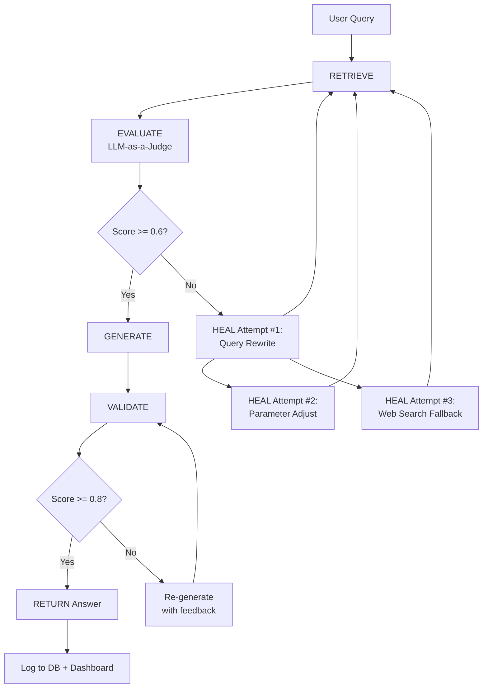

# Architecture: Self-Healing RAG Pipeline

## Overview

This system implements an autonomous, agentic Retrieval-Augmented Generation (RAG) pipeline that can detect when retrieval or generation quality is insufficient and self-correct through an iterative feedback loop.

## The Self-Healing Loop



## Component Architecture

```
┌──────────────┐     ┌─────────────────────┐     ┌──────────────┐
│              │     │                     │     │              │
│   Frontend   │────▶│   Backend (FastAPI) │────▶│   Qdrant     │
│  (Next.js)   │     │   /api/* endpoints  │     │  (Vector DB) │
│              │     │                     │     │              │
│   Recharts   │◀────│  Orchestrator loop  │◀────│   Postgres   │
│  Dashboard   │     │                     │     │  (Metadata)  │
└──────────────┘     └─────────────────────┘     └──────────────┘
                              │
                              ▼
                     ┌─────────────────────┐
                     │      Redis          │
                     │  (Cache / Queue)    │
                     └─────────────────────┘
```

## Pipeline Steps in Detail

### 1. RETRIEVE
Fetches the top-k documents from Qdrant vector store using cosine similarity search against the query embedding.

### 2. EVALUATE (LLM-as-a-Judge)
An LLM grades each retrieved document for relevance to the user query on a scale of 0-1. The average relevance score determines if healing is needed.

**Decision**: If average relevance < 0.6 → Trigger HEALING

### 3. HEAL (Iterative)
Up to 3 healing attempts, each with a different strategy:

| Attempt | Strategy | Description |
|---------|----------|-------------|
| 1 | Query Rewriting | LLM rewrites query to expand terms and add context |
| 2 | Parameter Adjustment | Increase top_k, lower relevance threshold |
| 3 | Web Search Fallback | Fall back to web search results (if enabled) |

### 4. GENERATE
LLM generates an answer strictly from the retrieved documents, with each claim cited to its source document.

### 5. VALIDATE
A second LLM pass checks if the generated answer is grounded in the source documents.

**Decision**: If confidence < 0.8 → Re-generate with specific error feedback (max 2 attempts)

### 6. RETURN
Returns the final answer with confidence score, source citations, and full pipeline execution logs.

## Data Flow

1. User submits query via POST /api/query
2. Orchestrator runs the pipeline loop
3. Each step logs its state to PostgreSQL
4. Pipeline completes → response returned to user
5. Dashboard queries PostgreSQL for aggregate metrics
